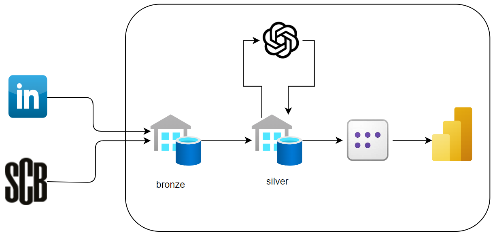

# Linkedin jobs Analysis for the Swedish job market 

## Overview

This project is an in-depth analysis designed to derive insights from LinkedIn job posts within the swedish market. It utilizes a robust architecture integrating various technologies and services to capture, store, process, and analyze jobs posted on LinkedIn on an hourly basis. Additionally, it incorporates population data at the city level to provide a comprehensive view of the swedish job market dynamics.

## Architecture

The architecture consists of two data pipelines. The first flow involves LinkedIn job data, which is ingested on an hourly basis into the bronze lakehouse. The second flow involves data from the Swedish Central Statistics Office (SCB), which is ingested into the bronze lakehouse on a monthly basis.

Both datasets are curated and transformed, then loaded into new tables in the silver lakehouse. Here, we use Azure OpenAI to enrich the job data by extracting important features from the job descriptions.

Finally, the data is aggregated in the default semantic model of the SQL endpoint of the silver lakehouse, and a Power BI report is built on top of it.

An overall picture of the architecture looks as follows:

## Fabric Workspace

The solution leverages a medallion architecture with two main lakehouses, `bronze` and `silver`, in the Fabric workspace. The workspace also consists of two main pipelines that orchestrate the data ingestion and transformations to and from the lakehouses:

1. `_jobs_data_hourly`:
   Fetches LinkedIn jobs data in Sweden on an hourly basis, with a sliding window of one month. This means that data older than one month is automatically deleted. It also fetches the company's follower count to show the popularity of the company posting the jobs. After that, it transforms and cleans the data, then upserts it to the silver lakehouse based on job IDs. It finishes by running the `AI_Inrich_Jobs_silver_Hourly` notebook, which feeds the job descriptions into Azure OpenAI to extract key information:

- **Tools**: A list of relevant tools mentioned in the job description.
- **Requirements**: A list of required skills, qualifications, or experience (excluding tools listed in Tools).
- **Offer**: A list of benefits provided by the employer.
- **WorkType**: This key can only be one of four values: Remote, Hybrid, In-Office, Null.

2. `_population_data_monthly`:
   Fetches the population data using the Swedish Central Statistics Office SCB API using a copy activity that lands the data in the `bronze` lakehouse in a csv format, then transform and *overwrite* the data in the `silver` lakehouse, since it is monthly data and we are only intersted in current month population stats.

## PowerBi report
The PowerBi report shows insights based on the hourly linkedin jobs ingested and with based on a swedish citis level. It consists of five different pages:
1. *Linkedin jobs key measures*: Provides insights into job counts based on seniority level, popularity, titles, employment type, and company name. Additionally, it includes a heat map of job counts across cities in Sweden.
2. *Sweden population insights*: Insights into the total population of Swedish cities, broken down by gender (men and women).
3. *Linkedin Job descriptions key measures*: Insights derived from LinkedIn job descriptions, showcasing job counts based on job offers, key requirements, tools, and work type. It also highlights company popularity by the number of LinkedIn followers.
4. *Seniority level requirements*: Analyzes the seniority level requirments.
5. *Seniority level Tools*: Analyzes the seniority level required tools.

## Co-pilot

Microsoft Copilot played a pivotal role across various phases of the project. In the experimenting phase, Copilot assisted with notebooks, providing guidance on different Spark dialects, whether Spark SQL or PySpark. This support streamlined the data exploration and transformation processes. As the team transitioned to developing the Power BI report, Copilot helped create various measures, enhancing the report’s analytical depth. Finally, in the documentation phase, Copilot ensured comprehensive and clear documentation, capturing all critical aspects of the project.

## Installation
To recreate the solution you should follow the steps below: 

1. Fork the [Linkedin_jobs_datalake](https://github.com/AnasMofleh/Linkedin_jobs_datalake.git) github repo.
2. Create your own Fabric workspace.
3. Follow Microsofts Learn documentation on how to [connect a workspace to a Git repo](https://learn.microsoft.com/en-us/fabric/cicd/git-integration/git-get-started?tabs=azure-devops%2CGitHub%2Ccommit-to-git#connect-to-a-git-repo) and use `MS-Hackathon` as the git root folder and `main` as the branch as follows: 

4. Finally, connect and sync the artefacts into your new Fabric workspace.
5. Add `ENDPOINT` and `API_KEY` to the [AI_Inrich_Jobs_Silver_Hourly](MS-Hackathon/AI_Inrich_Jobs_Silver_Hourly.Notebook/notebook-content.py) notebook.
6. Done, you should now be able to use the report. 🎉

## Authors

- [Mohammad Raja](https://www.linkedin.com/in/mohammad-raja-455a62229/) - Initial work and maintenance.
- [Anas Mofleh](https://www.linkedin.com/in/anas-mofleh/) - Initial work and maintenance.

---
